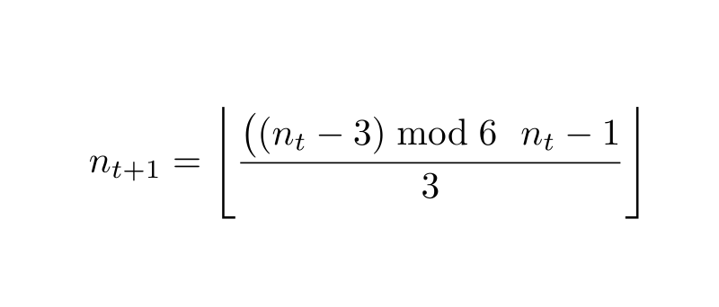
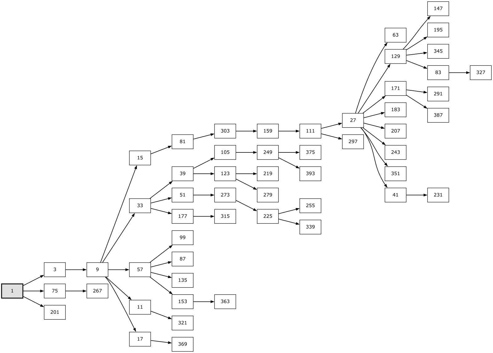

# Collatz Hidden Order

**A symbolic and structural framework for the accelerated Collatz map**

This repository accompanies the paper:

> **Hidden Order in the Collatz Map**
> A symbolic reorganization of forward and backward Collatz dynamics

📄 **Paper (PDF):**
[Collatz_Hidden_Order.pdf](paper/Collatz_Hidden_Order.pdf)

 

## Overview

The Collatz map is one of the simplest unsolved problems in mathematics to state, yet one of the most resistant to global analysis.
While forward iteration appears chaotic and backward iteration produces infinite branching trees, the dynamics are governed by rigid local rules.

This work shows that those rules admit a **complete symbolic organization**.

Rather than analyzing numerical trajectories directly, the paper reorganizes both backward and forward Collatz dynamics into **finite, computable symbolic structures** with exact decoding rules. Infinite predecessor trees collapse into compressed representations, and forward dynamics induce structured transitions between canonical families.

The result is a reframing of Collatz dynamics as a **finite, hierarchical system**, rather than an opaque iteration process.

 

## A representative structural identity

A central observation of the paper is that the **entire backward Collatz predecessor dynamics on odd integers** can be written as a *single normalized update rule*.

For any odd integer $n_t \ge 3$, the smallest predecessor is given by

This one-line formula simultaneously encodes:

- all three odd residue classes modulo $6$,
- **the immediate terminal case** $n_t \equiv 3 \pmod 6$,
- and the forced descent structure governing all odd predecessor chains.

It serves as the starting point for the paper’s proof that **every odd predecessor chain terminates at $-1$** and **admits no cycles**.

 

## Core results (at a glance)

The paper establishes the following structural results:

- **Exact termination and acyclicity.**
  Every odd predecessor chain terminates at **−1** and cannot contain a cycle.

- **Canonical terminal seeds.**
  Every odd integer admits a unique symbolic predecessor chain terminating at a canonical seed

  $$
  m_0 \equiv 3, 9, 15 \pmod{24}.
  $$

  These seeds index disjoint *terminal families* that partition the odd integers.

- **Compressed predecessor structure.**
  Infinite backward predecessor trees collapse into finite descriptions via compressed **01-tower** structure, yielding exact symbolic orbit codes.

- **Forward dynamics at the family level.**
  Accelerated forward Collatz iteration induces transitions between terminal families, recorded as **terminal chains**. Reversing these chains assembles into a rooted **terminal family tree** anchored at the forward-terminal family $1$.

- **Universal orbit codes.**
  The framework extends to all positive integers via symbolic encodings that combine accelerated odd dynamics with $2$-adic structure. Classical Collatz orbits can be reconstructed **exactly** from these codes, without iterating the Collatz map.

 

## A visual summary

*Terminal families form a rooted tree under reverse τ-chains, providing a canonical phase space for accelerated Collatz dynamics. Forward iteration induces downward motion in this tree, even when numerical values increase.*

 

## What this work does *not* claim

This work does **not** resolve the Collatz conjecture.

Instead, it transforms the problem from an opaque iteration process into a **finite, symbolically organized system** with explicit structure. Any remaining obstruction to global convergence is localized to a discrete, indexed set of canonical terminal seeds.

 

## Repository scope

This repository accompanies the paper and serves two purposes:

1. To host the stable, citable version of the manuscript.
2. To provide **reference-grade reproducibility artifacts** supporting verification of the paper’s symbolic constructions.

At present, the repository contains the paper and figures only.

Planned additions (non-normative) include:

- **Reference implementations** of the symbolic constructions defined in Appendix D,
- Minimal scripts and notebooks demonstrating termination, encoding/decoding, and terminal family structure,
- Reproducible generation of selected figures where feasible.

All such artifacts prioritize **fidelity to the paper’s definitions** over performance or large-scale computation.

The paper itself remains **self-contained**: all results are proved symbolically and do not rely on code for validity.

 

## Status

This is an independent research project.

The paper is complete and stable in its current form.

Future updates to the repository may include clarifications, reference implementations, reproducible tooling, or potential extensions and refinements of the symbolic framework developed in the paper.

 

## Reproducibility note

Where code artifacts are provided, they are intended as **executable witnesses**
to the symbolic constructions developed in the paper.

They are not required to follow the arguments, but allow readers to verify
definitions, symbolic encodings, and structural claims computationally on
bounded domains.

 

## Citation

If you reference this work, please cite the paper directly.

Gandhi Mohan, K. B. (2026).
*The Hidden Order of the Collatz Problem.*
Zenodo. https://doi.org/10.5281/zenodo.18119832

 

## License

This repository is released under the MIT License.
